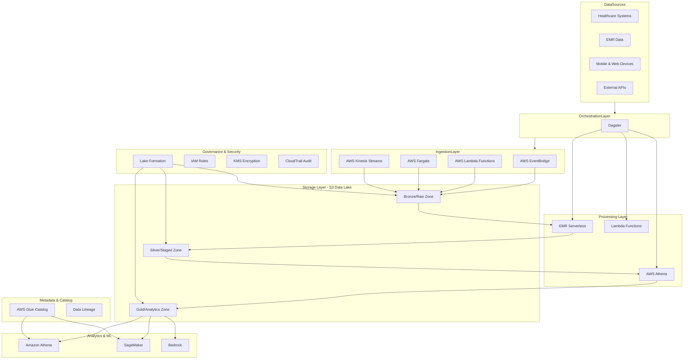

# A360 Data Lake


> A healthcare-optimized Apache Iceberg data lakehouse built on AWS Modern Data Architecture (MDA) framework. This architecture enables secure, scalable healthcare data processing with integrated AI/ML pipelines and robust governance controls.

## Table of Contents

- [Overview](#overview)
- [Architecture](#architecture)
- [Key Features](#key-features)
- [Differences from AWS MDA Framework](#differences-from-aws-mda-framework)
- [Prerequisites](#prerequisites)
- [Quick Start](#quick-start)
- [Project Structure](#project-structure)
- [Infrastructure Components](#infrastructure-components)
- [Data Processing](#data-processing)
- [Security & Compliance](#security--compliance)
- [CI/CD Pipeline](#cicd-pipeline)
- [Development Guide](#development-guide)
- [Testing](#testing)
- [Monitoring & Operations](#monitoring--operations)
- [Contributing](#contributing)
- [License](#license)
- [References](#references)

## Overview

The A360 Data Lake is a modern, healthcare-focused data platform built on AWS that provides:

- **Secure Data Storage**: Multi-layered S3 architecture with KMS encryption
- **Advanced Governance**: Lake Formation-based access controls and data governance
- **Healthcare Compliance**: HIPAA-aligned security controls and audit logging
- **Modern Processing**: EMR Serverless with Apache Spark for scalable data processing
- **AI/ML Ready**: Integrated machine learning pipelines and feature stores
- **Cross-Account Sharing**: Secure data sharing across organizational boundaries

## Architecture



## Key Features

### 🏥 Healthcare Optimized
- HIPAA-compliant security controls
- PHI data handling capabilities
- Healthcare data model support
- Audit logging for compliance

### 🔒 Security & Compliance
- Customer-managed KMS encryption
- Fine-grained Lake Formation permissions
- Cross-account data sharing
- Network isolation and VPC controls

### ⚡ Modern Processing
- EMR Serverless for cost-effective Spark processing
- Real-time and batch processing capabilities
- Auto-scaling compute resources
- Integrated data quality frameworks

### 🤖 AI/ML Integration
- SageMaker integration for model training
- Feature store capabilities
- Model deployment pipelines
- Automated ML workflows

### 🔄 DataOps
- Infrastructure as Code with AWS CDK
- Automated CI/CD with GitHub Actions
- Multi-environment support (staging/prod)
- Comprehensive testing framework

## Differences from AWS MDA Framework

| Aspect | AWS MDA Framework | A360 Data Lake |
|--------|------------------|----------------|
| **Package Management** | pip/requirements.txt | uv with lock files |
| **Python Version** | Various | Python 3.12.9 standardized |
| **CI/CD** | Basic CDK deployment | GitHub Actions with OIDC |
| **Healthcare Focus** | Generic data lake | HIPAA-aligned, healthcare-specific |
| **Documentation** | Basic setup docs | Full developer documentation |
| **Cross-Account** | Manual setup | Automated RAM sharing |

## Prerequisites

- **AWS Account** with administrative permissions
- **Python 3.12.9** installed
- **uv** package manager ([installation guide](https://github.com/astral-sh/uv))
- **Node.js 22.2.0** for CDK
- **AWS CLI v2** configured
- **Docker** for containerized builds

## Quick Start

1. **Clone the repository**
   ```bash
   git clone https://github.com/Aesthetics-360/a360-data-lake.git
   cd a360-data-lake
   ```

2. **Set up Python environment**
   ```bash
   uv venv
   source .venv/bin/activate
   uv sync --all-extras --dev
   ```

3. **Install CDK dependencies**
   ```bash
   cd infra
   npm ci
   ```

4. **Configure AWS credentials**
   ```bash
   aws configure
   aws sso login --profile DataLake-Dev
   ```

5. **Deploy infrastructure**
   ```bash
   uv run cdk deploy --all --profile DataLake-Dev
   ```

6. **Upload sample data** (optional)
   ```bash
   cd ../utils
   uv run s3_sample_data_uploader.py --profile DataLake-Dev
   ```

## Project Structure

```
a360-data-lake/
├── 📁 infra/                     # AWS CDK infrastructure code
│   ├── 📁 stacks/               # CDK stack definitions
│   ├── 📁 tests/                # Infrastructure tests
│   └── 📄 app.py                # CDK app entry point
├── 📁 spark/                     # PySpark applications
│   ├── 📁 src/                  # Spark job source code
│   └── 📁 test/                 # Spark job tests
├── 📁 utils/                     # Utility scripts
│   └── 📄 s3_sample_data_uploader.py
├── 📁 .github/workflows/        # CI/CD pipelines
├── 📄 pyproject.toml            # Python project configuration
├── 📄 uv.lock                   # Dependency lock file
└── 📄 README.md                 # This file
```

## Infrastructure Components

### Storage Layer
- **Bronze Zone**: Raw data ingestion with archival policies
- **Silver Zone**: Cleaned and validated data
- **Gold Zone**: Business-ready analytics datasets
- **Athena Workspace**: Query result storage

### Security & Access
- **KMS Encryption**: Customer-managed keys with rotation
- **Lake Formation**: Fine-grained access controls
- **IAM Roles**: Least-privilege access patterns
- **Cross-Account Sharing**: Secure data federation

### Processing
- **EMR Serverless**: Managed Spark runtime
- **AWS Glue**: ETL job orchestration
- **Lambda Functions**: Event-driven processing

### Governance
- **Data Catalog**: Centralized metadata management
- **Quality Gates**: Automated data validation
- **Lineage Tracking**: End-to-end data flow visibility

## Data Processing

The platform supports multiple processing patterns:

- **Batch Processing**: Large-scale ETL with EMR Serverless
- **Streaming**: Real-time processing with Kinesis
- **Interactive**: Ad-hoc analysis with Athena
- **ML Workloads**: Model training and inference

See [spark/README.md](spark/README.md) for detailed processing documentation.

## Security & Compliance

### HIPAA Alignment
- Encryption at rest and in transit
- Access logging and monitoring
- Data retention policies
- Secure data destruction

### Access Controls
- Role-based access control (RBAC)
- Tag-based access control (TBAC)
- Cross-account permissions
- Service-linked roles

### Monitoring
- CloudTrail for API auditing
- CloudWatch for operational metrics
- Security Hub for compliance monitoring

## CI/CD Pipeline

The project uses GitHub Actions for automated deployment:

- **Build & Validate**: Code quality checks and testing
- **Security Scanning**: CDK-nag security analysis
- **Deploy**: Multi-environment deployment workflow
- **Integration Testing**: End-to-end validation

See [.github/workflows/](/.github/workflows/) for pipeline definitions.

## Development Guide

### Setting Up Development Environment

```bash
# Install dependencies
uv sync --all-extras --dev

# Run tests
uv run pytest

# Format code
uv run black .

# Type checking
uv run mypy .
```

### Adding New Infrastructure

1. Create new stack in `infra/stacks/`
2. Add to `infra/stacks/component.py`
3. Write tests in `infra/tests/`
4. Update documentation

### Creating Spark Jobs

1. Add job to `spark/src/`
2. Create tests in `spark/test/`
3. Update job configurations
4. Test locally with `spark-submit`

## Testing

### Infrastructure Tests
```bash
cd infra
uv run pytest
```

### Spark Job Tests
```bash
cd spark
uv run pytest
```

### Integration Tests
```bash
# Deploy to staging environment
# Run end-to-end tests
uv run pytest -k e2e
```

## Monitoring & Operations

### Key Metrics
- Data processing latency
- Storage costs and utilization
- Security events and access patterns
- Data quality scores

### Alerting
- Failed job notifications
- Security violations
- Cost anomalies
- Data freshness SLAs

### Maintenance
- Regular security patching
- Cost optimization reviews
- Performance tuning
- Backup verification

## Contributing

We welcome contributions! Please see our [contributing guidelines](CONTRIBUTING.md) for details on:

- Code standards and formatting
- Testing requirements
- Security considerations
- Documentation standards

## License

**Proprietary License - Aesthetics360**

Copyright (c) 2025 Aesthetics360. All rights reserved.

This software and associated documentation files (the "Software") are proprietary to Aesthetics 360 and are protected by copyright, trademark, and other intellectual property laws. 

**Terms:**
- This Software is licensed, not sold
- No rights are granted except as expressly stated herein
- Unauthorized copying, distribution, or modification is strictly prohibited
- Commercial use requires explicit written permission from Aesthetics 360
- Healthcare data processing must comply with HIPAA and applicable regulations


## References

- [AWS Data Foundations Framework](https://github.com/aws-samples/aws-data-foundations-framework/tree/main)
- [AWS Lake Formation Best Practices](https://aws.github.io/aws-lakeformation-best-practices/)
- [Apache Iceberg Documentation](https://iceberg.apache.org/docs/latest/)
